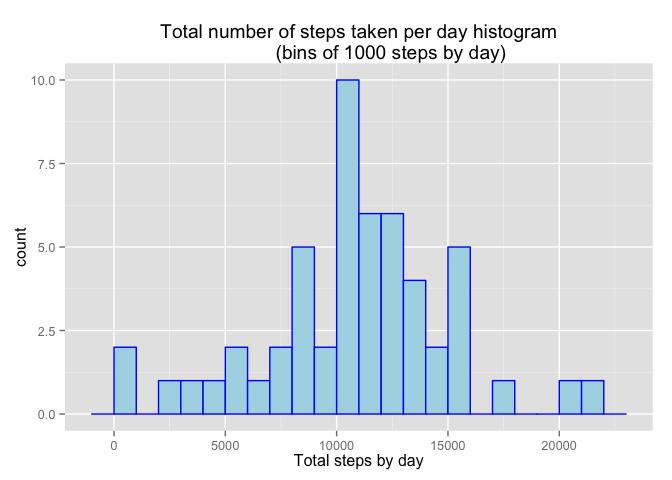
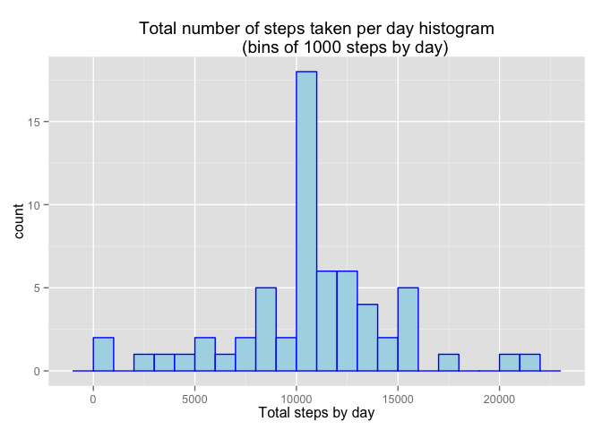
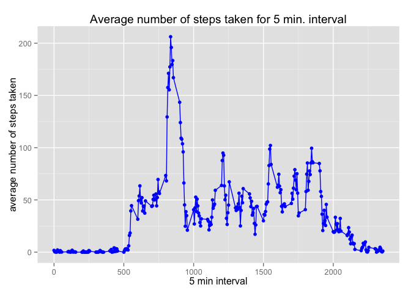
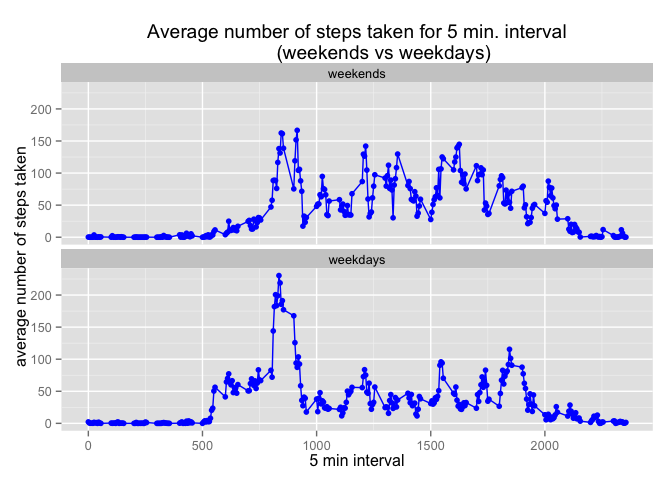

# Reproducible Research: Peer Assessment 1


## Loading and preprocessing the data

To start the analysis it is necesaary to load the package used in the rest
of the document and read the raw data from file.


```r
# Show inline code up to 10^5 in standard notation and 2 digit precision
options(scipen = 1, digits=2) 

library(ggplot2)  # Histograms, plots, ...
```

The data for this assignment is in the zip file *activity.zip*, and 
inside there is a file *activity.csv* containing all the raw data used 
in this data analysis.


```r
unzip('activity.zip')
raw.data <- read.csv("activity.csv")
file.remove('activity.csv')
```

```
## [1] TRUE
```

Note that the *activity.csv* file is removed after read the data in order to avoid to 
store the same data in two diferents files in the *github* repository.

The variables included in this dataset are:

1. **steps**: Number of steps taking in a 5-minute interval (numeric,
    missing values are coded as NA).

2. **date**: The date on which the measurement was taken in YYYY-MM-DD format.
   In this analysis, the **date** is read as a factor.

3. **interval**: Identifier for the 5-minute interval in which measurement 
   was taken (numeric).


## What is mean total number of steps taken per day?

In order to address this question, it is necesaary to obtain a tidy data
that agregates the step data by day. Ones the data processing step is done,
the distribution of the data is presented using the *ggplot2* plotting system. 
The mean and median of steps taken per day is computed, ignoring the missing data.


```r
question1 <- function(dt){
  data.date <- aggregate(steps ~ date, data=dt, FUN=sum)

  plt <- ggplot(data = data.date, aes(x=steps)) + 
    geom_histogram(color = 'blue', fill= 'light blue', binwidth= 1000)  +
    xlab('Total steps by day') + 
    ggtitle("Total number of steps taken per day histogram
            (bins of 1000 steps by day)")
  print(plt)
  data.date  
}

tidy.q1 <- question1(raw.data)
```

 

The mean value is 10766.19 and the 
median is 10765.

It is interesting to note that the values of the mean and the median are relatively close. 
This could be because the distribution of the total number of steps taken per day is quite symetrical, 
as seen in the histogram.


## What is the average daily activity pattern?

The data is agreggate by the 5-minute interval of time, computing the mean value of
the data, excluding all the missing values. The results are presented in the next plot.


```r
question2 <- function(dt){
  data.interval <- aggregate(steps ~ interval, data=dt, FUN=mean)
  plt <- ggplot(data= data.interval, aes(x=interval, y=steps)) + 
    geom_line(color='blue') + 
    geom_point(color='blue') +
    xlab('5 min interval') + 
    ylab("average number of steps taken") +
    ggtitle("Average number of steps taken for 5 min. interval")
  print(plt)
  data.interval
}

tidy.q2 <- question2(raw.data)
```

 

and the 5-minute interval in which on average across all the days in the dataset, 
contains the maximum number of steps is
835.

## Imputing missing values

In the raw data set there is 2304 missing values
in the variable **step** (about a 13%). In the other two variables there are not 
missing values.

The strategy proposed to impute missing data is to substitue the missing 
values by the mean value at the same 5-minute interval. 


```r
imputed.data <- raw.data
for (interval in unique(tidy.q2$interval)){
  imputed.data$steps[is.na(imputed.data$steps) & 
                     imputed.data$interval == interval] <- 
                        tidy.q2$steps[tidy.q2$interval == interval]
}
```

In order to inspect if the imputation of data is consistent with
the original data, the sames plots are performed.


```r
tidy.q1.imputed <- question1(imputed.data)
```

 

```r
tidy.q2.imputed <- question2(imputed.data)
```

 

where the mean value is 10766.19 and the 
median is 10766.19. The plots, the mean value and the median value
with imputation are close from that obtained without imputation. I think this is a
evidence to assert that the imputing strategy is correct.

## Are there differences in activity patterns between weekdays and weekends?

For this question, a new factor variable is appended in the dataset with two levels
(*weekday* and *weekend*) indicating whether a given date is a weekday or weekend day.
Then, a panel plot is presented, containing a time series plot (i.e. type = "l") of the 
5-minute interval (x-axis) and the average number of steps taken, averaged across all 
weekday days or weekend days (y-axis). 


```r
imputed.data$weekday <- factor(!weekdays(strptime(raw.data$date, "%Y-%m-%d")) 
                               %in% c("Sunday", "Saturday"), 
                               labels = c('weekends', 'weekdays'))

data.interval <- aggregate(steps ~ interval + weekday, data=imputed.data, FUN=mean)
ggplot(data= data.interval, aes(x=interval, y=steps)) + 
  geom_line(color='blue') + 
  geom_point(color='blue') +
  xlab('5 min interval') +
  ylab("average number of steps taken") +
  ggtitle("Average number of steps taken for 5 min. interval
          (weekends vs weekdays)") +
  facet_wrap(~ weekday, ncol=1)
```

 

From this plots, it is possible to assert that the distribution of steep along the day is more uniform in the weekends.

